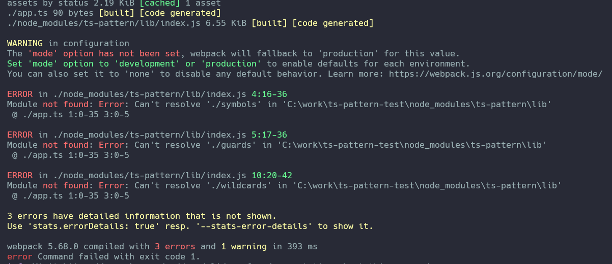

To reproduce the error, run:

```bash
yarn webpack --config webpack.js
```


I also tried upgrading `webpack` and `webpack-cli` to their latest versions, which still fails, albeit with a slightly different formatting:


